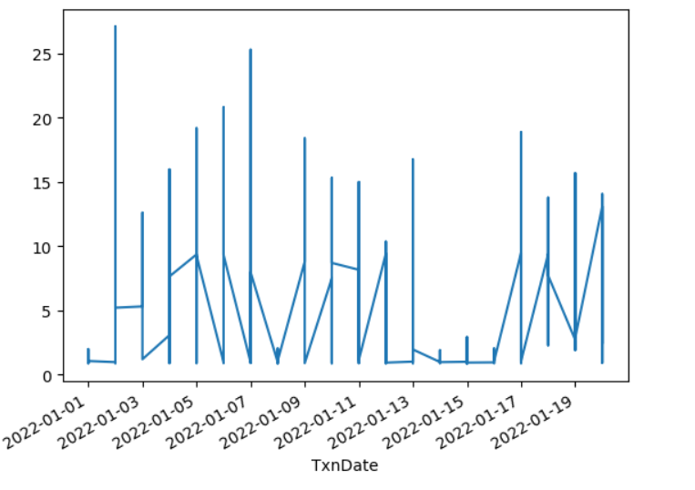
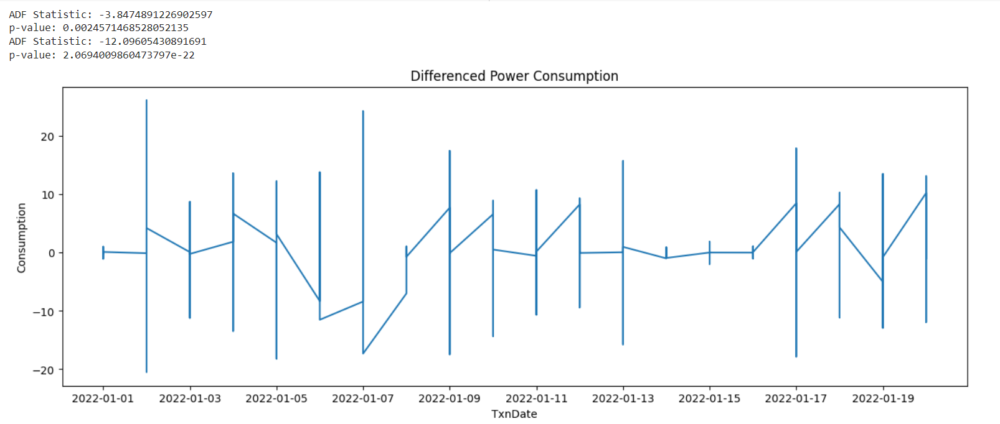
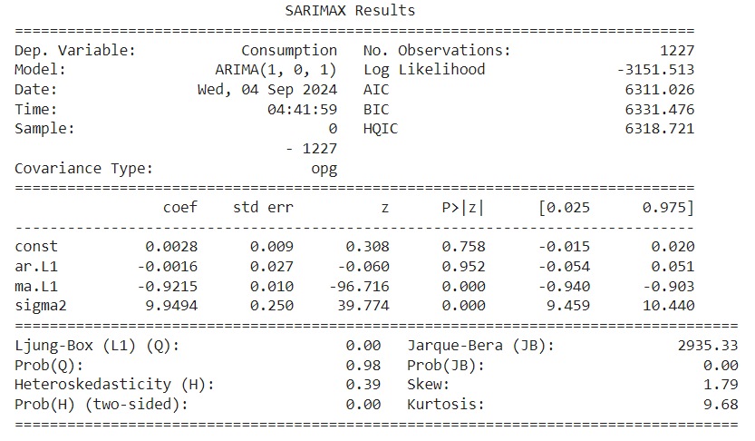
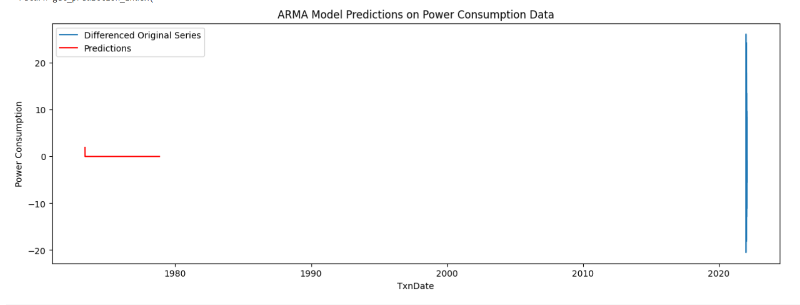

### Developed By: Shaik Shoaib Nawaz
### Register No: 212222240094
# Ex.No:04   FIT ARMA MODEL FOR TIME SERIES
# Date: 


### AIM:
To implement ARMA model in python.
### ALGORITHM:
1. Import necessary libraries.
2. Set up matplotlib settings for figure size.
3. Define an ARMA(1,1) process with coefficients ar1 and ma1, and generate a sample of 1000 data points using the ArmaProcess class. Plot the generated time series and set the title and x-
axis limits.

4. Display the autocorrelation and partial autocorrelation plots for the ARMA(1,1) process using
plot_acf and plot_pacf.
5. Define an ARMA(2,2) process with coefficients ar2 and ma2, and generate a sample of 10000 data points using the ArmaProcess class. Plot the generated time series and set the title and x-
axis limits.

6. Display the autocorrelation and partial autocorrelation plots for the ARMA(2,2) process using
plot_acf and plot_pacf.
### PROGRAM:
```
import numpy as np
import pandas as pd
import matplotlib.pyplot as plt
from statsmodels.tsa.arima.model import ARIMA
%matplotlib inline
train=pd.read_csv('/content/KwhConsumptionBlower78_1.csv')
train.timestamp=pd.to_datetime(train.TxnDate,format='%d %b %Y')
train.index=train.timestamp
train.drop("TxnDate",axis=1,inplace=True)
train.head()
print(train.columns)
train.columns = train.columns.str.strip()
train['Consumption'].plot()
from statsmodels.tsa.stattools import adfuller

# Check for stationarity
result = adfuller(train['Consumption'])

print('ADF Statistic:', result[0])
print('p-value:', result[1])

# Since the p-value is > 0.05, the data is not stationary. We need to difference it.
train_diff = train['Consumption'].diff().dropna()

# Check for stationarity again
result = adfuller(train_diff)

print("ADF Statistic:", result[0])
print("p-value:", result[1])

# Plot the differenced data
plt.figure(figsize=(15, 5))
plt.plot(train_diff)
plt.title('Differenced Power Consumption')
plt.xlabel('TxnDate')
plt.ylabel('Consumption')
plt.show()
# Fit the ARMA(1, 1) model
model = ARIMA(train_diff, order=(1, 0, 1))
model_fit = model.fit()

# Print the model summary
print(model_fit.summary())
start = len(train_diff)
end = start + 2000
predictions = model_fit.predict(start=start, end=end)

# Plot the results
plt.figure(figsize=(15, 5))
plt.plot(train_diff, label='Differenced Original Series')
plt.plot(predictions, label='Predictions', color='red')
plt.legend()
plt.title('ARMA Model Predictions on Power Consumption Data')
plt.xlabel('TxnDate')
plt.ylabel('Power Consumption')
plt.show()
```

### OUTPUT:
 1. Dataset:
 

 2. ADF and P values:
 

 3. Model summary: 
  

  4. ARMA Model:
  


### RESULT:
Thus, a python program is successfully created to fit ARMA Model.
